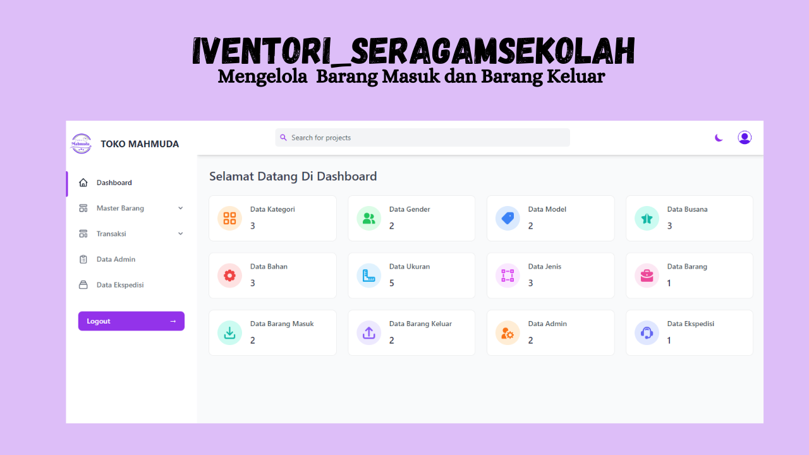
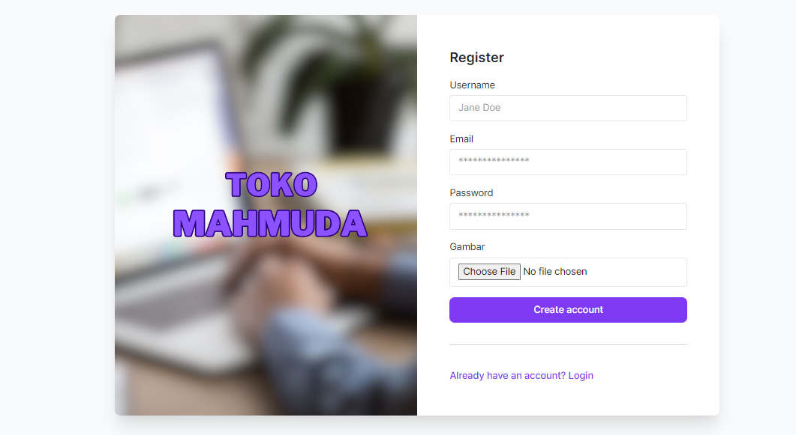
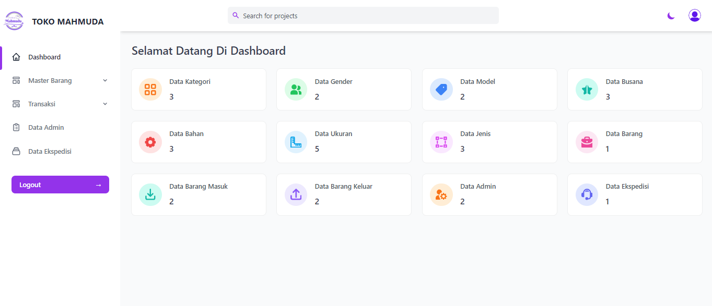
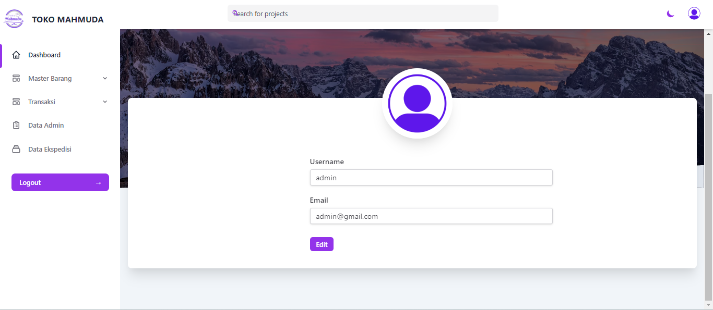
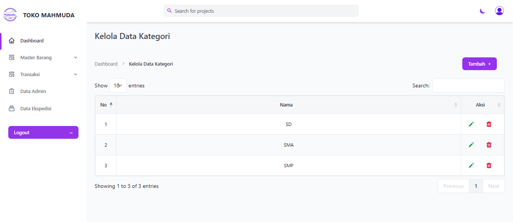
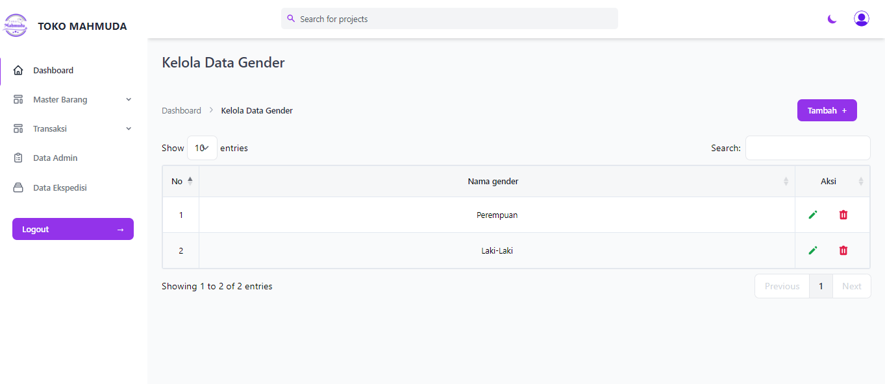
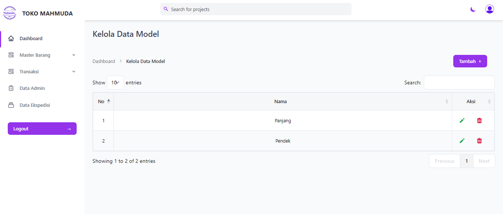
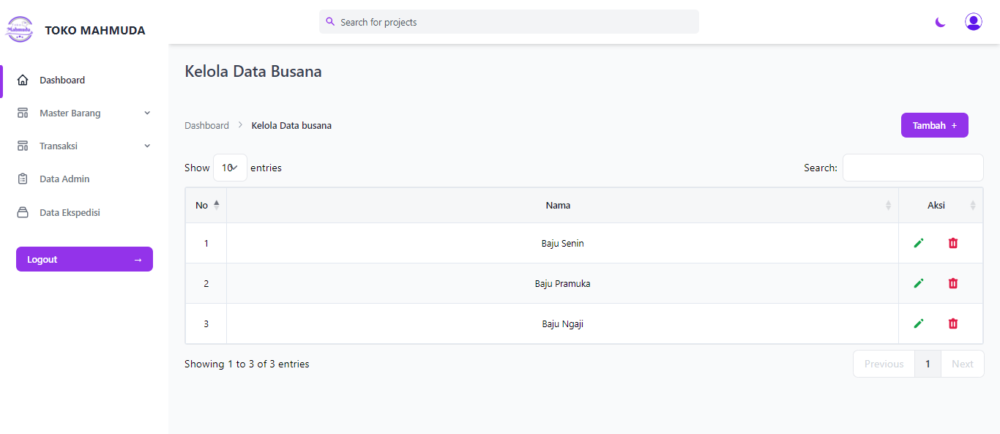

# SISTEM INFORMASI INVENTORI SERAGAM SEKOLAH BERBASIS WEB PADA TOKO MAHMUDA

## 🏢Tempat Penelitian : 
Jl. Mangga Raya No.66, Kuranji, Kec. Kuranji, Kota Padang, Sumatera Barat.

## 🎨 Masalah 
Masalah-masalah yang ditemukan di tempat penelitian, yaitu sebagai berikut:

1. Kesulitan dalam mengelola persediaan barang : Toko Mahmuda mengalami kesulitan dalam mengelola persediaan barang, termasuk memantau stok, menghitung jumlah barang yang tersedia, dan memperkirakan kapan barang perlu diisi kembali. Hal ini disebabkan oleh pencatatan stok barang secara manual menggunakan buku, sehingga sering terjadi kesalahan dan stok pakaian tidak pernah memiliki data yang pasti.
2. Kesulitan dalam pencarian sisa stok barang : Toko Mahmuda mengalami kesulitan dalam mencari sisa stok barang yang tidak memiliki catatan, sehingga owner harus cek ke gudang dengan mencari stok masih tersedia atau tidak dan ini memakan waktu yang lama.

## 🤩 Solusi

Sistem ini dapat membantu dalam mengelola persediaan barang, termasuk memantau stok, menghitung jumlah barang yang tersedia, dan memperkirakan kapan barang perlu diisi kembali. Dengan menggunakan sistem informasi inventory, toko Mahmuda dapat mengatasi permasalahan tersebut.
Dengan menerapkan solusi-solusi ini, toko Mahmuda dapat memanfaatkan keuntungan teknologi informasi untuk mengatasi permasalahan pengelolaan persediaan. Sistem informasi berbasis web akan membantu dalam mengotomatiskan proses, meningkatkan akurasi data, dan meningkatkan efisiensi operasional secara keseluruhan.

## 👨‍💻 Ouput,Input dan Proses
a) Output yang akan dihasilkan, yaitu :
1) Laporan barang masuk
2) Laporan barang keluar

b) Input yang diperlukan, yaitu :
1) Data Admin
2) Data Ekspedisi
3) Data Kategori
4) Data Gender
5) Data Model
6) Data Busana
7) Data Bahan
8) Data Ukuran
9) Data Jenis
10) Data Barang
11) Data Barang Masuk
12) Data Barang Keluar

c) Proses yang akan dilakukan yaitu :
1) Pengelolaan barang masuk dan barang keluar
 
 
## ♨️Pembagian Tugas
| No  | Peran          | Anggota Tim        |
| --- | -------------- | ------------------ |
| 1   | Frontend       | Citra, Werry       |
| 2   | Backend        | Ayu, Yessi         |
| 3   | Collaborator   | Citra, Ayu, Werry, Yesi   |

## Teknologi

| No  | Bidang      | Tech       |
| --- | -------------- | ------------------ |
| 1   | Frontend       |       |
| 2   | Backend        |        |
| 3   | Collaborator   |  	  |

## Alur Bisnis

## Relasi Tabel

## Preview

